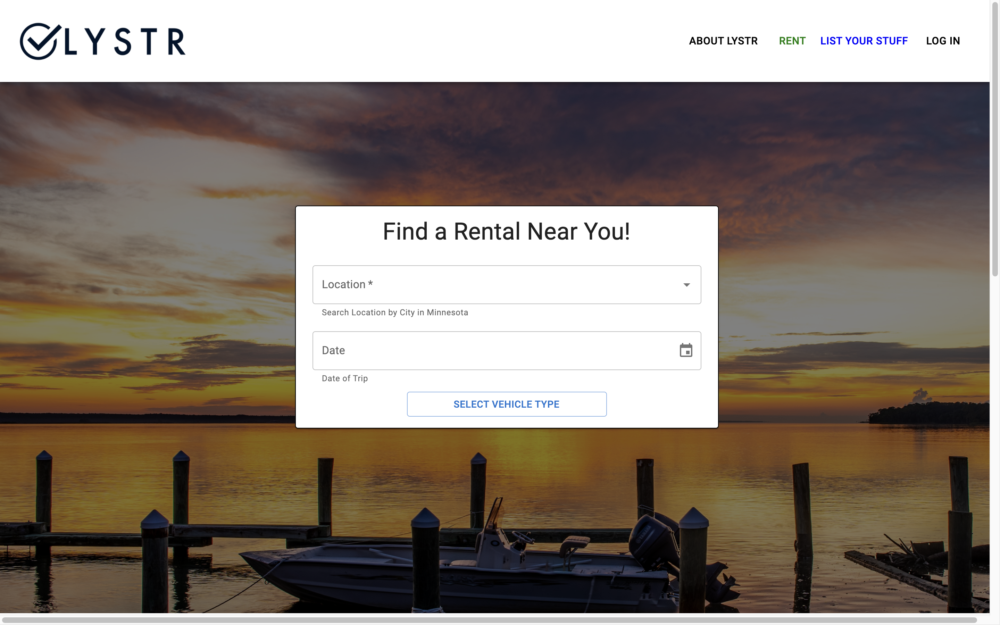
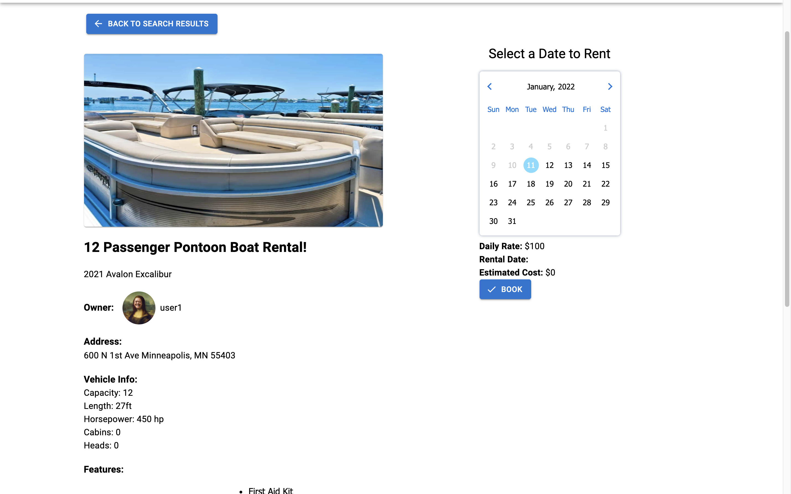
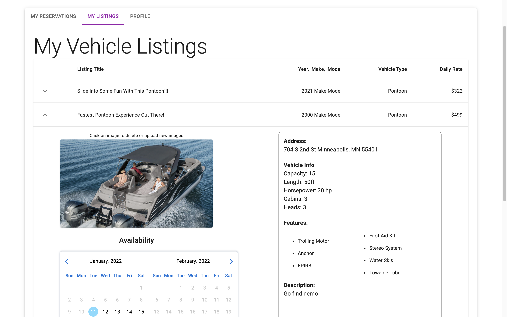
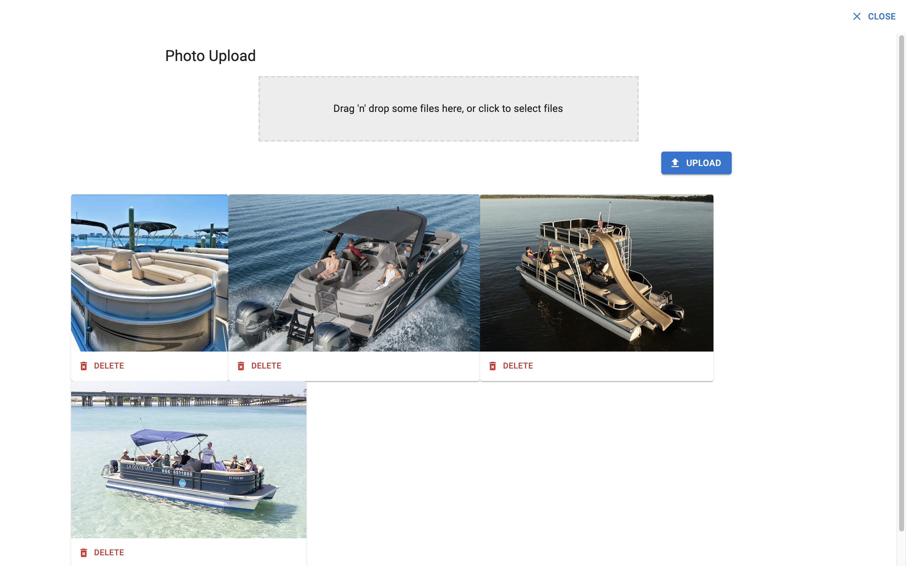

    

# LYSTR

## Table of Contents

- [LYSTR](#lystr)
  - [Table of Contents](#table-of-contents)
  - [Description](#description)
  - [Screenshots](#screenshots)
  - [Built With](#built-with)
  - [Getting Started](#getting-started)
    - [Prerequisites](#prerequisites)
    - [Installation](#installation)
  - [Usage](#usage)
  - [License](#license)
  - [Acknowledgements](#acknowledgements)
  - [Contacts](#contacts)

## Description

LYSTR aims to make the connection between Watercraft Owners and people who want to rent Watercraft easier in MN. Specifically LYSTR is targeting people who already list their vacation homes on common rental platforms who would like to rent their Watercraft out in conjunction with the home. The rental platform will encompass the renting-out of a few types of Watercraft: Pontoons, Runabouts, Fishing boats, Kayaks/Canoes and Jetskis. The platform will be broken down into 2 different experiences: one for the Owner and one for the Renter. The Owner's experience will include the ability to list a Watercraft for rent by typing in its details, rental rate, and uploading photos, along with the ability to enter personal contact information and availability of the Watercraft. The Renter experience will include the ability to search a location and see the Watercraft available for rent within a specified radius of that location. The Renter will be able to narrow down their search by type of Watercraft and availability. The Renter will then be able to select and book a Watercraft, as well as gain access to the Owner’s contact information to confirm rental reservations.

## Screenshots

## Built With

## Getting Started

In order to observe and use the functionalities of this application, the user will be required to sign up for a few third-party API keys. The required third-party APIs offers both free and paid services. The required API keys are as followed:

- [Amazon Simple Storage Service (AWS S3)](https://aws.amazon.com/s3/">https://aws.amazon.com/s3/)
- [OpenCage Geocoding API](https://opencagedata.com/)

### Prerequisites

Softwares used in creating this application includes:

- [Visual Studio Code](https://code.visualstudio.com/)
- [PostgreSQL](https://www.postgresql.org/)
- [Postico](https://eggerapps.at/postico/)
- [Node.js](https://nodejs.org/en/)
- [Nodemon](https://nodemon.io/)

The application's repository may require alterations to lines of codes if used with other softwares that are not listed above.

### Installation

1. To run this application, the user should fork the repository onto their own GitHub account. In the user's repository, the user should copy the link and clone the repository onto their local system. Navigate to the repository folder using the terminal and run command line `npm install`
   - `$ cd ../lystr`
   - $ `npm install`

 

2. Create a .env file in the repository folder and insert in the following lines with the placeholder variables.

   SERVER_SESSION_SECRET="`strongPassword`"  
   AWS_BUCKET_NAME="`bucketName`"  
   AWS_BUCKET_REGION="`bucketRegion`"  
   AWS_ACCESS_KEY="`accessKey`"  
   AWS_SECRET_KEY="`secretKey`"  
   REACT_APP_OPENCAGE_API_KEY="`openCageKey`"  

   Replace `strongPassword` with a strong password of the user's choice or use [https://passwordsgenerator.net/](https://passwordsgenerator.net/) to generate a password to replace it with.

 

3. Create an Amazon Simple Storage Service (AWS S3) account. After account creation, follow this link to set up a AWS S3 Bucket for image upload: [https://docs.aws.amazon.com/AmazonS3/latest/userguide/create-bucket-overview.html](https://docs.aws.amazon.com/AmazonS3/latest/userguide/create-bucket-overview.html).

   During bucket set up, take note of the:

   - bucket name
   - bucket region
   - secret key (SUPER IMPORTANT! This key will only show up once and the user will not have access to it afterwards)
   - access key

   After creation, replace all corresponding placeholder variables in the .env file with the information and key obtained from AWS S3, for example, replace `bucketName` with the bucket name provided from AWS S3, and so forth.

 

4. Create an OpenCage Geocoding API account and obtain the API key. In the .env file, replace `openCageKey` with the API key given upon registration.

   Now make sure all lines of the .env file have meaningful keys and no longer have the placeholder variables. If there are still placeholder variables, be sure to replace with corresponding keys.

 

5.  Create a local postgreSQL database called `lystr` with Postico using the command lines from the database.sql file. Using different database systems may require the user to alter or add additional command lines to reflect the example database provided.

 

6. To start up the application, enter in the terminal the npm command lines of:

   - `npm run server`
   - `npm run client`

   The server should be running on `http://localhost:5000` whereas the client should be on `http://localhost:3000`. Both the server and the client is required to be up and running for the application to run successfully.

## Usage

Once the application is up and running, the user should be redirected to the browser with the application loaded. If not, open up a browser and enter in the url:

- `http://localhost:3000`

Users of this application will be vehicle owners looking to list their vehicles for rental or renters search for available vehicles to rent. Users can also be both, listing their own vehicles and searching for other vehicles to rent.

- Listing A Vehicle For Rental: 

  - To list a vehicle to rent out to other users, the user must first have created an account and be logged in.
  - In the navigation bar, near the top of the application, there will be a 'LIST YOUR STUFF' button that will redirect the user to a form to add a new vehicle into the database.
  - The user will then enter in all the required fields. Features of the listed vehicles can be selected from the given options. At least 1 photo is required to be uploaded. The last part of the form will be selecting the dates that user wish to make the vehicle available for other users to rent out.

- Searching For Vehicles To Rent:  

  - The application allows any user, whether they are logged in or not logged in, to use the search feature.
  - The user can search by a city location in MN and select from the auto-populated options. The user will also have to select the date of which they wish to find a vehicle to rent for.
  - After selecting location and date, the user will have to select the type of vehicle they wish to search for.
  - Upon clicking 'Find Boat To Rent', the user will be redirected to a results page. If there are no available vehicles, the page will display no results, otherwise, the results be will displayed as info cards and pins on the interactive map.
  - The pin locations reflect the location of the available vehicles. Clicking on a pin will pull up a small informational window on that particular vehicle.
  - Clicking on the info card or 'Learn More' on both the card and pin pop-up will redirect the user to a details page of the vehicle. The details page will display more detailed information and images on the vehicle as well as other available dates.
  - Users that are not logged in will not be able to proceed with a booking request and will be asked to logged in first. If the user is already logged in, the user can select the date which the user wish to rent out the vehicle using the provided calendar and click 'Book'.
  - After clicking 'Book', a pop up with owner information will be displayed and ask the user to contact the owner to proceed with the next steps of booking the vehicle such as payment.

- User Dashboard:  
  - Users that have created an account and is logged in can access the User Dashboard view by clicking on 'User Dashboard' when the avatar in the navigation bar is clicked.
  - The 'My Reservations' tab panel will display the user's rental history along with information about the vehicle that was rented including the vehicle's owner information.
  - The 'My Listings' tab panel will display the user's vehicles that they've listed out for rental along with vehicle information, availability and upcoming rentals on the vehicle.
  - The 'Profile' tab panel displays the user's account information and gives the user the option to edit their information and update their profile picture.

## License

<a href="https://choosealicense.com/licenses/unlicense/">The Unlicense</a>

## Acknowledgements

Special thanks to the Lystr team, Dean Adleman, CEO and Co-Founder, and Hong Huie, Technology Director, for providing us with the opportunity to develop this amazing application. This application was developed with the support and direction of the Lystr team.

We would also like to extend a thanks to our instructors, Dane Smith and Liz Kerber, the Solinas Cohort, and the whole greater community at Prime Digital Academy, for providing us with the necessary tools and skills to succeed.

Lastly, we would like to thank our friends and families for continuing to support as we've continued to grow into developers.

## Contacts

Austin Kammerer 
 

Chaoching Vang 
 

Emily Schwartau 
 

Sam Clavette 
 
